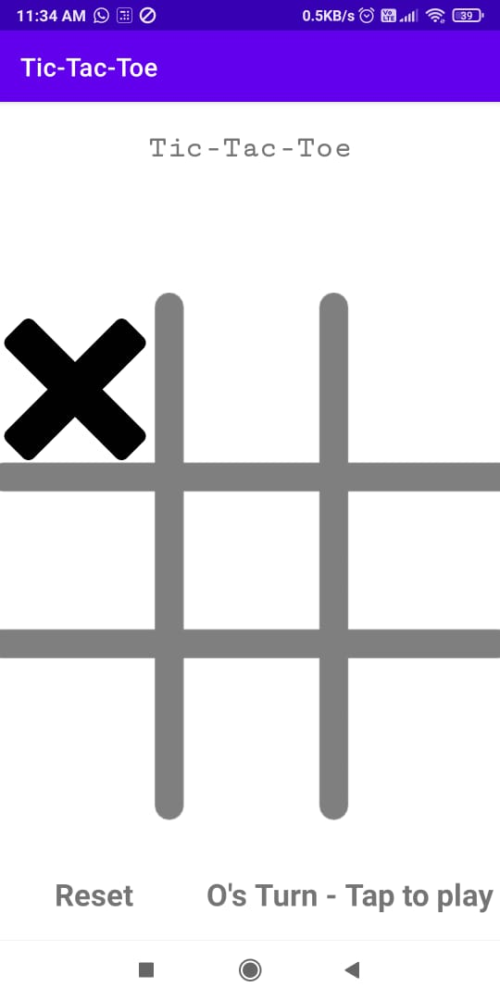
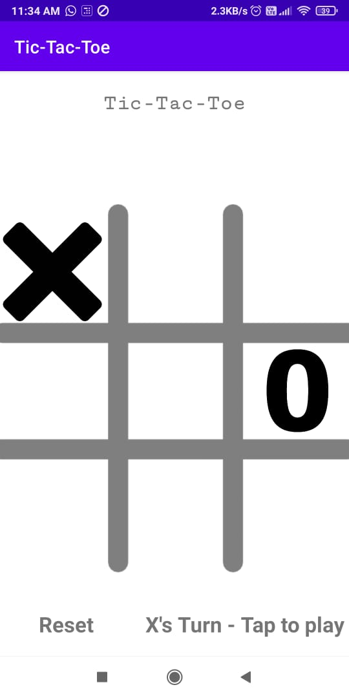
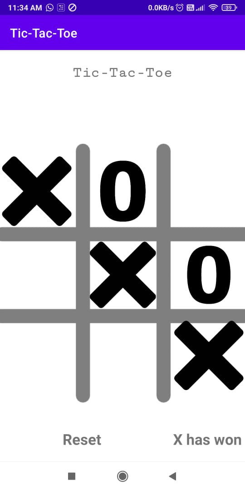
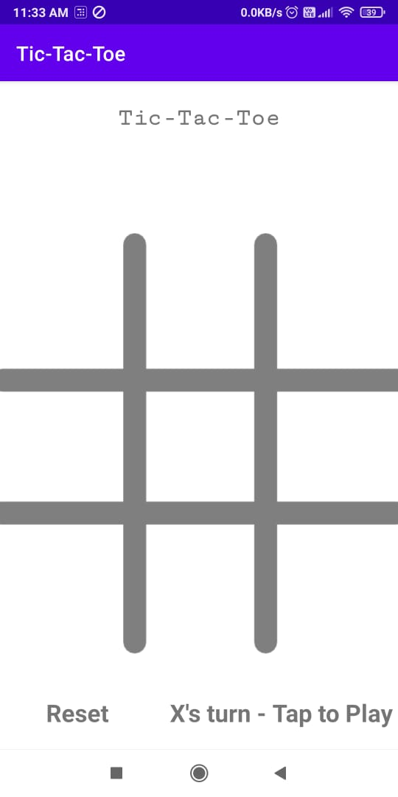

# Tic-Tac-Toe
This classic game contributes to children's developmental growth in numerous ways including their understanding of predictability, problem solving, spatial reasoning, hand-eye coordination, turn taking and strategizing.

